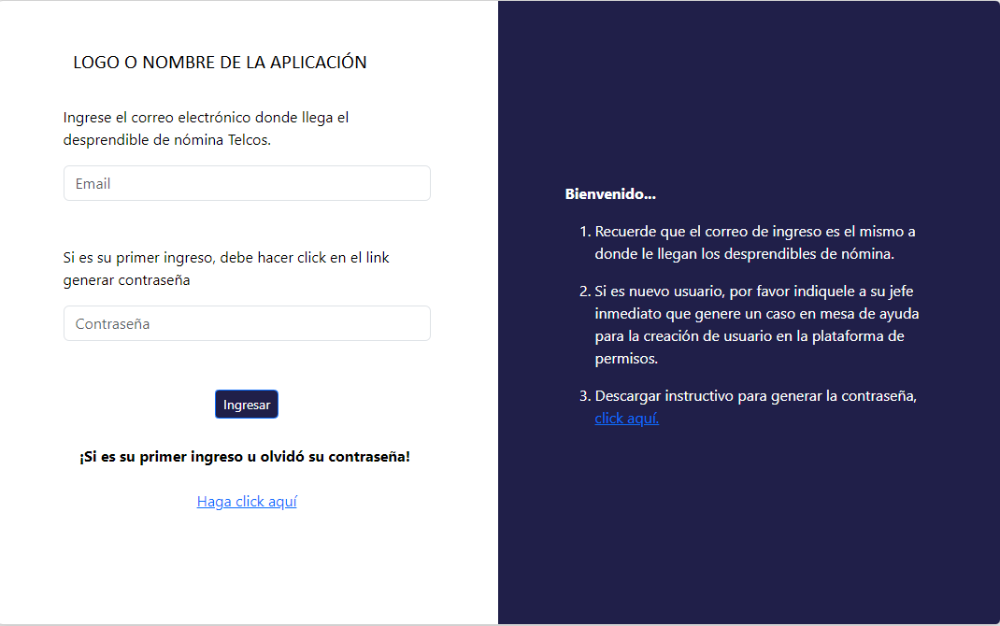
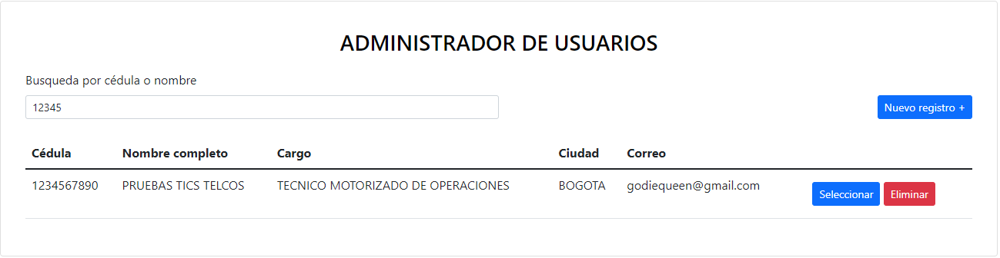
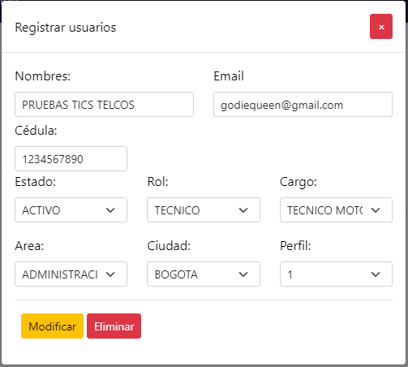

# Login password reset

## Descripción

Este proyecto es una solución web login para el acceso a una plataforma con gestión de contraseñas vía correo electrónico, asignación de roles para los diferentes módulos de la plataforma.

## Características

- **Autenticacion:** Autenticación basada en contraseña
- **Gestión de contraseñas:** Metodo de restablecimiento de contraseña por correo electrónico
- **Tipo de cifrado:** Hash MD5.

## Capturas de pantalla:

## LOGIN
 

## ADMINISTRADOR DE USUARIOS
 

## REGISTRO DE USUARIOS


- **Diseño**: Las ventanas o cuadros de dialogo están basados en Modal.

## Tecnologías Utilizadas

- **Frontend**: HTML5, CSS3, JavaScript, BootStrap.
- **Backend**: PHP8
- **Base de Datos**: 10.4.28-MariaDB - mariadb.org binary distribution
- **Autenticación**: Basado en tokens
- **Servidor Web**: Apache/2.4.56 (Win64) OpenSSL/1.1.1t PHP/8.0.28
- **Version PHP**: Versión de PHP: 8.0.28
- **Notificaciones**: Email, SendMail
- **Versionamiento de Código**: Git

## Requisitos

- Versión de PHP: 8.0.28
- 10.4.28-MariaDB - mariadb.org

## Instalación

1. Clona el repositorio:

   ```bash
   git clone https://github.com/Godie84/login-roles-usuarios.git
   cd nombre-del-proyecto

## Uso

1. **inicio de sesión**: Los usuarios pueden autenticarse en la aplicación.
2. **Gestión de contraseñas**: Los usuarios pueden generar o restablecer la contraseña por medio del correo electrónico registrado por el administrador de la aplicación 
3. **Notificaciones**: El sistema notificará al usuario sobre el restablecimiento de la contraseña por medio del correo electrónico registrado en la aplicación


## Licencia

Este proyecto está licenciado bajo la Licencia MIT. Consulta el archivo `LICENSE` para más detalles.

## Contacto

**Diego Fernando Reina Ramírez**

Email: [diego.reina9@hotmail.com](mailto:diego.reina9@hotmail.com)

LinkedIn: [tu-perfil-linkedin](https://linkedin.com/in/tu-perfil-linkedin)

GitHub: [tu-usuario-github](https://github.com/tu-usuario-github)

